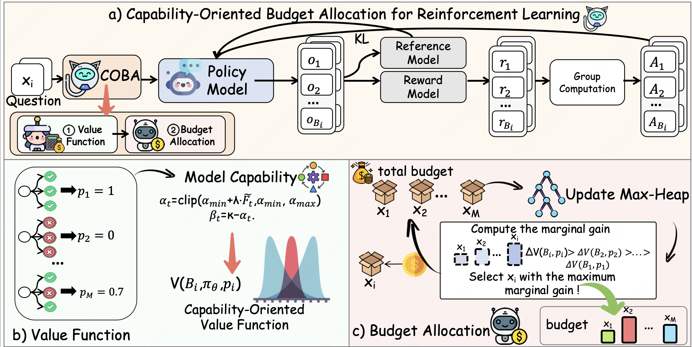
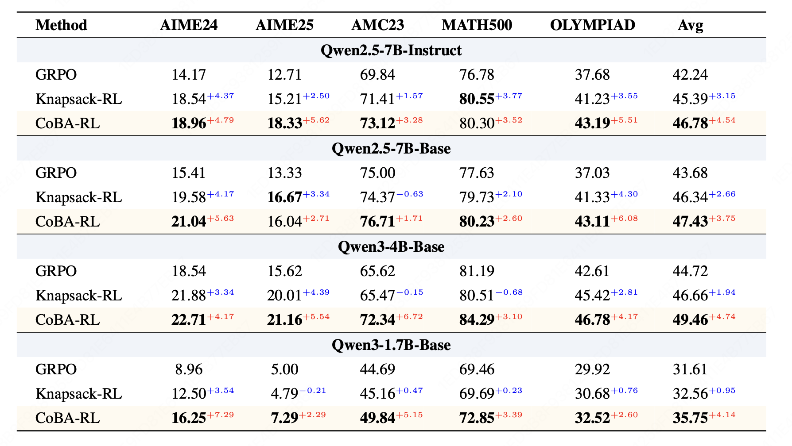

# CoBA-RL: Capability-Oriented Budget Allocation for Reinforcement Learning in LLMs

<p align="center">
  <a href="https://arxiv.org/abs/2602.03048"></a>
  <a href="https://github.com/verl-project/verl"></a>
  <a href="https://github.com/Within-yao/CoBA-RL/blob/main/LICENSE"></a>
</p>

<p align="center">
  
</p>

Official implementation of **"CoBA-RL: Capability-Oriented Budget Allocation for Reinforcement Learning in LLMs"**.

## Overview

Reinforcement Learning with Verifiable Rewards (RLVR) has emerged as a key approach for enhancing LLM reasoning. However, standard frameworks like GRPO typically employ a **uniform rollout budget** across all prompts, leading to resource inefficiency. Moreover, existing adaptive methods often rely on instance-level metrics, failing to capture the model's dynamic learning state.

We propose **CoBA-RL**, a reinforcement learning algorithm that dynamically allocates rollout budgets based on the model's evolving capability. It consists of two core components:

- **Capability-Oriented Value Function**: Modeled as a Beta distribution whose shape parameters are driven by the global failure rate. It continuously self-calibrates to shift focus from exploitation (consolidating easy tasks) to exploration (tackling hard tasks) as training progresses.

- **Heap-Based Greedy Budget Allocation**: An efficient algorithm that iteratively assigns budget to samples with the highest marginal gain, maximizing aggregate training value.

## Results

<p align="center">
  
</p>

## Getting Started

We inherit environment setup from [veRL](https://github.com/verl-project/verl). Please follow the official docs:

- **Install**: https://verl.readthedocs.io/en/latest/start/install.html

```bash
# 1. Create and activate conda environment
conda create -n cobarl python=3.10
conda activate cobarl

# 2. Install verl (follow the official guide above)

# 3. Clone CoBA-RL
git clone https://github.com/Within-yao/CoBA-RL.git
cd CoBA-RL
```

### Data Preparation

We use **DAPO-Math-17K** as the training dataset and evaluate on five math benchmarks. Place data and model files as follows:

```text
CoBA-RL/
├── data/
│   ├── dapo-math-17k-processed.parquet    # Training set
│   ├── aime-2024.parquet                  # Evaluation
│   ├── aime-2025.parquet
│   ├── amc23.parquet
│   ├── math500.parquet
│   ├── minervamath.parquet
│   └── olympiad.parquet
├── models/
│   └── Qwen2.5-7B-Instruct/              # Model checkpoint
```

### Quick Start

Run training from the **project root directory**:

```bash
conda activate cobarl
bash examples/coba_rl/run_qwen2.5_7b_coba_rl.sh
```

The script auto-detects GPUs and supports both single-node and multi-node training.

## Project Structure

```
CoBA-RL/
├── recipe/coba_rl/
│   ├── main_coba_rl.py                # Entry point & Hydra config management
│   ├── coba_rl_ray_trainer.py         # CoBA-RL trainer (extends RayPPOTrainer)
│   ├── budget_allocators.py           # BetaAllocator implementation
│   └── config/
│       └── coba_rl.yaml               # Hydra configuration
├── verl/                              # verl framework
├── examples/coba_rl/
│   └── run_qwen2.5_7b_coba_rl.sh     # Launch script
```

## Citation

If you find this work useful in your research, please consider citing:

```bibtex
@misc{yao2026coba,
  title={CoBA-RL: Capability-Oriented Budget Allocation for Reinforcement Learning in LLMs}, 
  author={Zhiyuan Yao and Yi-Kai Zhang and Yuxin Chen and Yueqing Sun and Zishan Xu and Yu Yang and Tianhao Hu and Qi Gu and Hui Su and Xunliang Cai},
  year={2026},
  eprint={2602.03048},
  archivePrefix={arXiv},
  primaryClass={cs.LG},
  url={https://arxiv.org/abs/2602.03048}, 
}
```

## Acknowledgements

This project builds upon several excellent open-source projects:

- [veRL](https://github.com/verl-project/verl) - Reinforcement learning training framework
- [SGLang](https://github.com/sgl-project/sglang) - Fast serving framework for LLMs
- [vLLM](https://github.com/vllm-project/vllm) - High-throughput LLM serving
- [Qwen](https://github.com/QwenLM) - Base language models

## License

This project is licensed under the Apache License 2.0 - see the [LICENSE](LICENSE) file for details.
